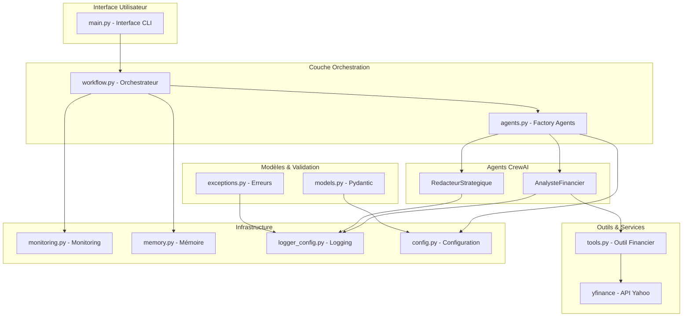
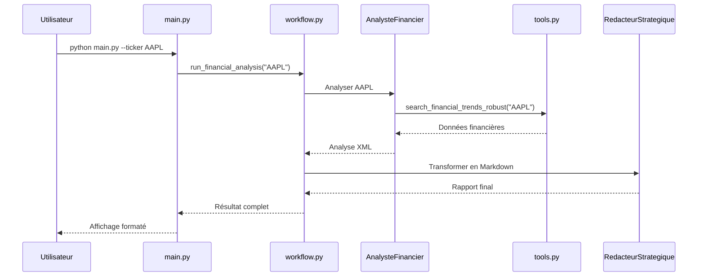
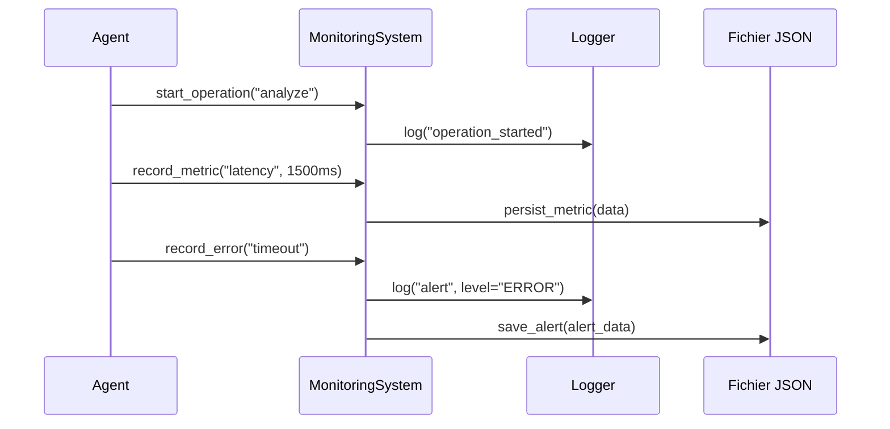

# 🏗️ Architecture - Orchestrateur Financier CrewAI

## Vue d'ensemble

L'Orchestrateur Financier est une application Python moderne basée sur CrewAI qui utilise des agents IA spécialisés pour l'analyse financière automatisée.

## 📊 Diagramme d'Architecture



## 🔧 Composants Principaux

### 1. **Interface Utilisateur** (`main.py`)
- Point d'entrée de l'application
- Interface CLI interactive
- Gestion des arguments de ligne de commande
- Affichage des résultats formatés

**Responsabilités :**
- Validation des entrées utilisateur
- Routage vers les fonctionnalités appropriées
- Présentation des résultats
- Gestion des erreurs utilisateur

### 2. **Orchestration** (`workflow.py`)
- Coordination des agents CrewAI
- Gestion du flux de travail
- Application des stratégies d'exécution
- Collecte et agrégation des résultats

**Pattern utilisé :** Strategy Pattern pour les différentes stratégies d'orchestration

### 3. **Agents Intelligents** (`agents.py`)
- **AnalysteFinancier** : Analyse des données financières
- **RedacteurStrategique** : Transformation en rapport Markdown
- Configuration basée sur YAML
- Intégration avec Google Gemini

**Pattern utilisé :** Factory Pattern pour la création d'agents

### 4. **Outils Métier** (`tools.py`)
- Outil de recherche financière robuste
- Intégration avec yfinance
- Gestion des retries et fallbacks
- Simulation de données en cas d'échec

### 5. **Infrastructure**

#### Monitoring (`monitoring.py`)
- Métriques en temps réel
- Alertes automatiques
- Persistance des données de performance
- Tableaux de bord des KPIs

#### Mémoire (`memory.py`)
- Gestion transactionnelle
- Buffer des conversations
- Politiques de rétention
- Nettoyage automatique

#### Configuration (`config.py`)
- Configuration centralisée avec Pydantic
- Validation automatique
- Gestion par environnement
- Pattern Singleton

#### Logging (`logger_config.py`)
- Logs structurés JSON
- Rotation automatique
- Niveaux multiples
- Formatage couleur pour développement

### 6. **Modèles et Validation**

#### Modèles (`models.py`)
- Modèles Pydantic pour validation
- Sérialisation XML/JSON/Markdown
- Types sécurisés
- Validation métier

#### Exceptions (`exceptions.py`)
- Hiérarchie d'exceptions custom
- Contexte riche pour debugging
- Messages user-friendly
- Traçabilité complète

## 🔄 Flux de Données

### 1. **Flux Principal d'Analyse**



### 2. **Flux de Monitoring**



## 🏛️ Patterns Architecturaux

### 1. **Layered Architecture**
- **Présentation** : CLI interface
- **Application** : Workflow orchestration
- **Domaine** : Agents et business logic
- **Infrastructure** : Monitoring, logging, persistence

### 2. **Plugin Architecture**
- Agents comme plugins
- Outils extensibles
- Stratégies d'orchestration modulaires

### 3. **Event-Driven Components**
- Monitoring basé sur événements
- Logging asynchrone
- Alertes réactives

## 🔒 Sécurité

### Couches de Sécurité

1. **Validation d'Entrée**
   - Validation Pydantic
   - Sanitisation des inputs
   - Détection d'injection

2. **Gestion des Secrets**
   - Variables d'environnement
   - Pas de hardcoding
   - Rotation des clés

3. **Monitoring de Sécurité**
   - Détection d'anomalies
   - Alertes de sécurité
   - Audit trail

## 📈 Performance

### Optimisations

1. **Cache**
   - Cache des données financières
   - LRU cache pour configuration
   - Cache des résultats d'agents

2. **Parallélisation**
   - Exécution parallèle possible
   - Agents asynchrones
   - Pipeline optimisé

3. **Resource Management**
   - Gestion mémoire automatique
   - Timeouts configurables
   - Cleanup automatique

## 🔧 Extensibilité

### Points d'Extension

1. **Nouveaux Agents**
   ```python
   class NewAgent(BaseAgent):
       def __init__(self):
           # Configuration spécifique
           pass
   ```

2. **Nouvelles Stratégies**
   ```python
   class CustomStrategy(OrchestrationStrategy):
       def execute(self, agents, tasks):
           # Logique custom
           pass
   ```

3. **Nouveaux Outils**
   ```python
   @tool("custom_tool")
   def custom_analysis_tool(ticker: str) -> dict:
       # Logique métier
       pass
   ```

## 📊 Métriques Architecture

### Métriques de Qualité
- **Complexité cyclomatique** : < 10 par fonction
- **Coverage tests** : > 80%
- **Dépendances** : Minimales et justifiées
- **Couplage** : Faible entre modules

### Métriques Performance
- **Latence moyenne** : < 2 secondes
- **Throughput** : > 100 analyses/heure
- **Utilisation mémoire** : < 500MB
- **Disponibilité** : > 99%

## 🚀 Déploiement

### Environnements

1. **Développement**
   - Logs verbeux
   - Mock des APIs externes
   - Tests automatiques

2. **Staging**
   - Configuration production-like
   - Tests d'intégration
   - Monitoring complet

3. **Production**
   - Optimisations performance
   - Monitoring avancé
   - Backup automatique

### Infrastructure Recommandée

- **Conteneurisation** : Docker
- **Orchestration** : Kubernetes
- **Monitoring** : Prometheus + Grafana
- **Logs** : ELK Stack
- **CI/CD** : GitHub Actions

---

## 📚 Références

- [CrewAI Documentation](https://docs.crewai.com/)
- [Pydantic Documentation](https://docs.pydantic.dev/)
- [Python Best Practices](../BEST_PRACTICES_GUIDE.md)
- [Design Patterns](../DESIGN_PATTERNS.md)